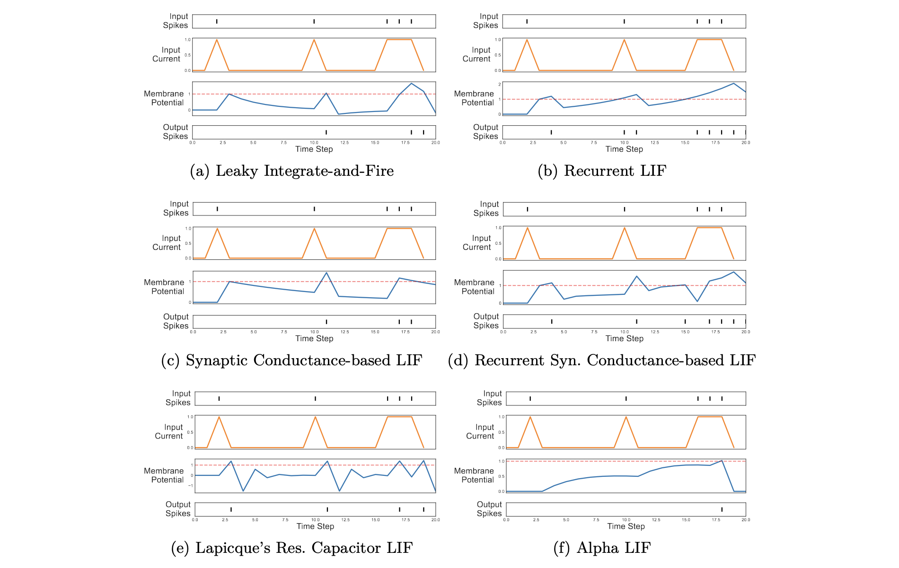

# Spiking Alternatives for the Leaky Integrate-and-Fire Neuron: Applications in Cybersecurity and Financial Threats

[](https://doi.org/10.5281/zenodo.15460335)

Source code of the paper entitled "Spiking Alternatives for the Leaky Integrate-and-Fire Neuron: Applications in Cybersecurity and Financial Threats" and presented at IbPRIA 2025, the 23rd International Conference on Artificial Intelligence.

## Paper Abstract

Spiking neural networks, the third generation of neural networks, offer a biologically plausible alternative to traditional deep learning models. They promise low-power applications for artificial intelligence, enabling a lower footprint for such algorithms that were becoming more energy-consuming with the venue of large language models.
The leaky integrate-and-fire (LIF) is the most common neuron model used for spiking neural networks due to its simplicity and low power consumption while remaining biologically plausible.
This paper compares the performance of optimized LIF variants from recurrent to synaptic conductance-based models that are then applied across four well-known image classification benchmarks and two real-world cybersecurity and financial fraud datasets. 
The experiments assess the performance of these neurons within a spiking window size of 10 and 50 timesteps, exploring the trade-off between performance and energetic consumption of each LIF variant. 
Our results show that the LIF neuron offers the best performance and energy consumption tradeoff among the tested LIF variants. However, in some cases, other variants can outperform the standard LIF neuron model with the cost of a higher footprint.

**Keywords:** 
Spiking Neural Networks $\cdot$
Leaky Integrate-and-Fire $\cdot$
Neuromorphic Computing $\cdot$
Cyberthreats $\cdot$
Financial Fraud



## Installation

To install the required packages, run the following command:
```bash
pip install -r requirements.txt
```
## Usage
Run the following command to begin the simulation:
```bash
python src/main.py --dataset mnist --steps 10 --neuron leaky
```
## Available Datasets
- `mnist`: MNIST dataset.
- `fashion_mnist`: Fashion MNIST dataset.
- `cifar10`: CIFAR-10 dataset.
- `cifar100`: CIFAR-100 dataset.
- `baf`: Bank Account Fraud dataset.
- `unsw_nb15`: UNSW-NB15 dataset.

## Available Neuron Models
- `leaky`: Standard Leaky Integrate-and-Fire neuron model.
- `rlif`:  Recurrent Leaky Integrate-and-Fire neuron model.
- `synaptic`: Synaptic Conductance-based Leaky Integrate-and-Fire neuron model.
- `rsynaptic`: Recurrent Synaptic Conductance-based Leaky Integrate-and-Fire neuron model.
- `lapicque`: Lapicque’s Resistor-Capacitor Leaky Integrate-and-Fire neuron model.
- `alpha`: Alpha Leaky Integrate-and-Fire neuron model.

## Troubleshooting with SNNTorch
If you encounter any issues with SNNTorch, please refer to following pull requests that solve some of the problems:
- https://github.com/jeshraghian/snntorch/pull/372
- https://github.com/jeshraghian/snntorch/pull/370

## Issues
This code is imported and adapted from the original research repository. Consequently, the code may contain bugs or issues. If you encounter any issues while running the code, please open an issue in the repository.
